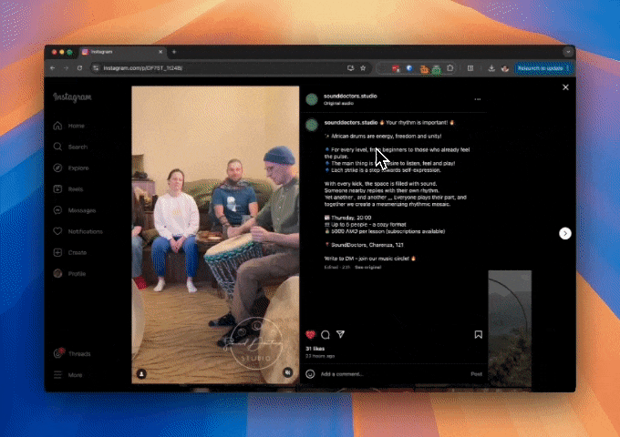
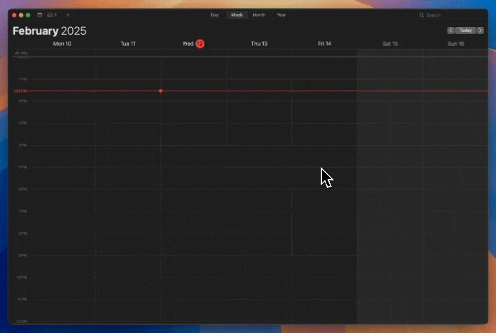

# Alfred Text to Calendar




An [Alfred](https://www.alfredapp.com/) workflow that uses AI to intelligently convert text into calendar events. Simply select text or type a command to create calendar events with natural language.

## Installation
1. Download `text-to-calendar.alfredworkflow`
2. Double click to open it in Alfred
3. When prompted, enter your OpenAI API key
4. Configure the hotkey:
   - Open Alfred Preferences
   - Go to Workflows > Text to Calendar
   - Double-click the Hotkey trigger
   - Press your preferred key combination

## Prerequisites
- [Alfred 5](https://www.alfredapp.com/) with Powerpack license
- Node.js v16 or higher (`brew install node` or download from [nodejs.org](https://nodejs.org))
- An OpenAI API key
- macOS Calendar app

## Usage

### Method 1: From Selected Text
1. Select any text containing event information
2. Press `⌘+⌥+I` (or your configured hotkey)

### Method 2: Direct Command
1. Type `c` followed by your event text
2. Press Enter

### Examples
- "Lunch with John tomorrow at 12:30pm at Cafe Luna"
- "Flight AA123 from SFO to JFK on Friday at 10am"
- "Team meeting every Monday at 9am starting next week"

## Features
- 📅 Convert any text into calendar events
- 🤖 Uses an LLM to parse event details
- ✨ Handles multiple events in a single text
- ✈️ Special formatting for flight details (includes airport codes, terminals, gates)
- 🌍 Automatic timezone handling based on location
- 📝 Supports all-day events and detailed descriptions
- 🔄 Handles relative dates (tomorrow, next week, etc.)

## Development
Want to contribute? Great! Here's how:

### Setup
1. Clone the repository
   ```bash
   git clone https://github.com/vhpoet/alfred-text-to-calendar.git
   cd alfred-text-to-calendar
   ```

2. Install dependencies
   ```bash
   yarn install
   ```

3. Make your changes and test locally

4. Build the workflow
   ```bash
   yarn build
   ```
   This will create a `text-to-calendar.alfredworkflow` file.

### Contributing
Pull requests are welcome! For major changes, please open an issue first to discuss what you would like to change.

## Troubleshooting

Common issues and solutions:

1. **"Node not found" error**:
   - Ensure Node.js is installed: `node --version`
   - If using nvm, make sure to use a full path to node in the workflow configuration

2. **API Key errors**:
   - Verify your OpenAI API key is correctly set
   - Make sure you have access to the model you've configured

3. **Calendar permission issues**:
   - Check System Settings > Privacy & Security > Calendar
   - Ensure Alfred has permission to access your Calendar

## License
[MIT](LICENSE)
